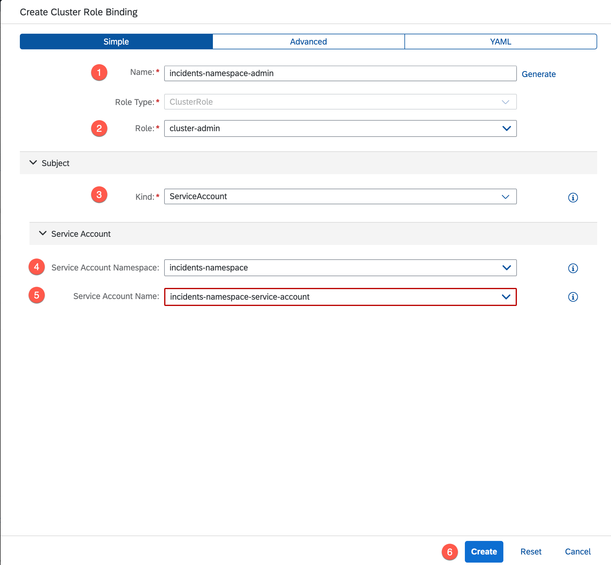
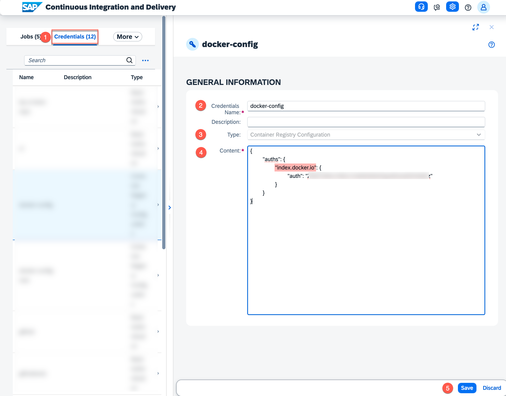
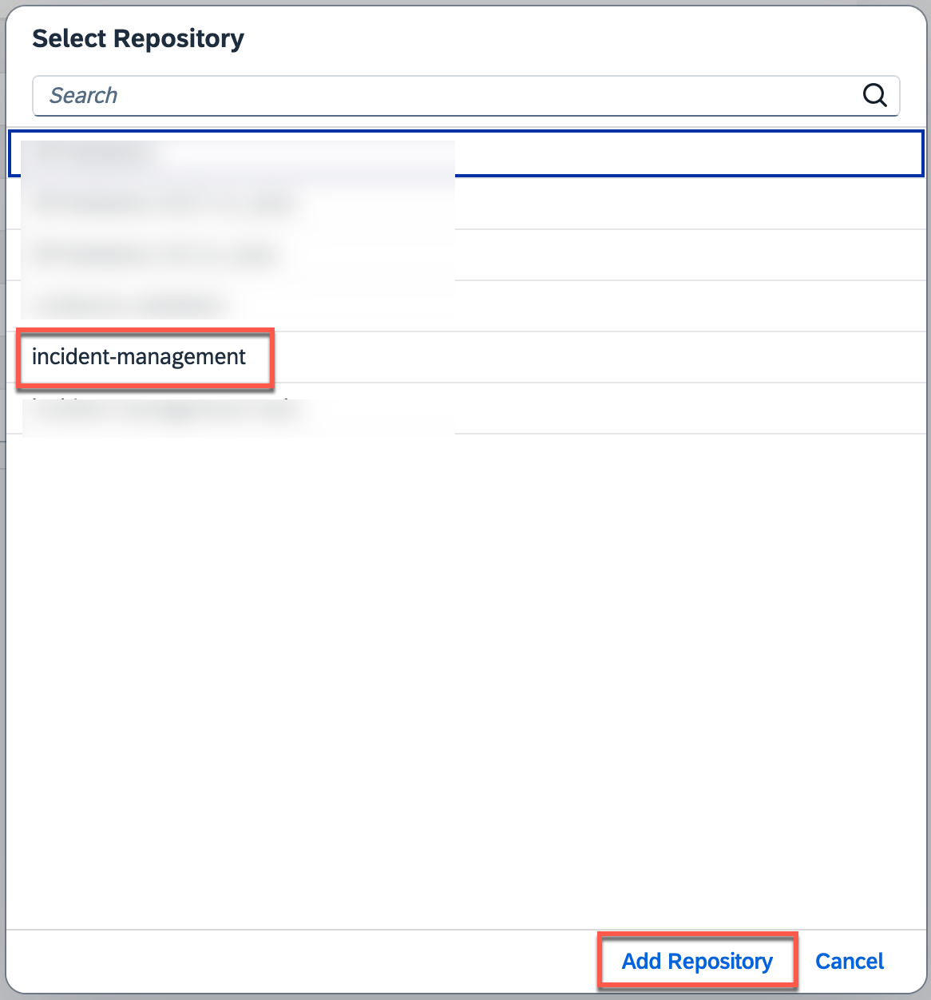

# Setup CI/CD Pipeline

This section describes how to configure and run a predefined continuous integration and delivery (CI/CD) pipeline using SAP Continuous Integration and Delivery service that automatically builds, tests and deploys your code changes to speed up your development and delivery cycles.
For more information, see See [SAP Continuous Integration and Delivery](https://discovery-center.cloud.sap/serviceCatalog/continuous-integration--delivery?region=all).

The steps below guide you through setting up your pipeline.

# Prerequsite
1. Develop the Incident Management application following the step by step tutorial [Develop a Full-Stack CAP Application](https://developers.sap.com/group.cap-application-full-stack.html)
2. Deployed the Incident Management application to SAP BTP Kyma Runtime following the tutorial [Deploy a Full-Stack CAP Application in SAP BTP, Kyma Runtime](https://developers.sap.com/group.deploy-full-stack-cap-kyma-runtime.html)

## Initialize a Repository in VS Code

To be able to perform the steps for setting up a CI/CD pipeline, you need a public repository. Currently, SAP Continuous Integration and Delivery supports **GitHub** and **Bitbucket** repositories.

For real application development, you need to consider the right place for your repository.

In this example, we’ll be creating a repository on GitHub. You need a **GitHub** account for this step.

1. In VS Code, navigate to **Explorer** and choose **Open Folder**. 


2. Open the folder which contains your Incident Management application.

3. Navigate to the project's root folder and check if file `.gitignore` is present. 

4. If your project already has a .gitignore file, ensure that the following snippet is added in it. Additionally if `resources/` is mentioned in the file, remove it. If there is no .gitignore file present create a file and add below code snippet
 
    ```
    node_modules/
    package-lock.json
    gen/

    *.mtar
    mta_archives/
    mta.yaml
    ```


5. Now navigate to **Source Control** and choose **Initialize Repository**.


6. Stage all the changes using the **+** icon and provide a relevant commit message. Then click on Commit.


7. Click **Publish Branch** and select the repository name to publish code to Github repository


    You may be redirected to a browser to authenticate into your GitHub account. Provide your GitHub username and password when prompted. When the changes are pushed, you’ll be able to see your project in your GitHub repository.

## Setup the Continuous Integration and Delivery Service

1. Enable SAP Continuous Integration and Delivery.
- In SAP BTP Cockpit, go to your subaccount.
- In Service Marketplace, type Continuous into the search box. Continuous Integration and Delivery service appears.
- Choose **Create**.


2. Assign role collection.

- In your SAP BTP subaccount, choose **Security -> Users**.
- Choose the name of your identity provider and navigate into it.
- From the menu, choose **Assign Role Collection**. Search for *CICD Administrator* and add the role to your user.

3. Ensure that you can open and access the application. In the cockpit,  go to **Instances and Subscriptions** to access the **Continuous Integration & Delivery** application.


    This should navigate you to the main page of the application.


<br>

**NOTE:**
**If you intend to deploy this application on a cluster that has a previous deployment of the same application, it is recommended to undeploy this old installation via your terminal using the command:**
```
helm uninstall incident-management -n <namespace>
```


## Retrieve Kyma Cluster Configuration Details

In order to run the pipeline using the CI/CD service, you need to create a service account. To do this, follow the steps.

1. First you need to create a namespace. In the SAP BTP Cockpit, open the **Kyma Dashboard** for your subaccount. 

    

    Your dashboard should look like this.


2. In the left navigation menu, choose **Namespaces** and then **+ Create Namespace**. 


    Provide any relevant name of your choice e.g: incidents-namespace. Also **Enable Sidecar Injection** and choose **Create**.


4. For this namespace, you need to create a Service Account. This is a non-human account which will authenticate your pipeline to access your cluster. See [Service Accounts](https://kubernetes.io/docs/concepts/security/service-accounts/). 

    Ensure you are in your created namespace. From the left navigation menu, click on the dropdown **Configuration** and navigate to **Service Accounts**. Here click on **+ Create Service Account**.
    

    Give your service account a name e.g: incidents-namespace-service-account and choose **Create**.
    

5. For your pipeline to access your Kyma cluster through this service account, it requires a set of configurations. This is defined in the **KubeConfig** file of the account. 

    To retrieve this, ensure you are on the page of the created service account and choose on **Generate TokenRequest**. 
    

    Here you can choose the **Expiration seconds** as desired from the dropdown and choose **Generate**.
    The configuration details should mention a token, your Kyma cluster and namespace.
   
    

    Now choose **Copy** as these details will be needed to create your pipeline credentials as described in the step below. 

7. Navigate to the Continuous Integration and Delivery Application (follow the steps mentioned above). On this page, choose **Credentials** and click on the **\+** to create a new credential. 

    Choose a relevant name for your credential e.g: kube-config. For type, choose **Kubernetes Configuration** from the dropdown. In the **Content space**, paste the KubeConfig file of the service account you copied from the previous step. Choose Create.
    

8. You need to add your service account to a **Cluster Role Binding**. For this go back to your **Cluster Details** page. 


    From the menu, choose **Configurations** and navigate to **Cluster Role Bindings**. Here click on **+ Create Cluster Role Bindingn** .


    On this page fill in the following details:

    - Name : <unique_relevant_name>
    - Role : **cluster-admin**
    - Kind : **ServiceAccount**
    - Service Account Namespace : &lt;namespace&gt;
    - Service Account Name : &lt;service_account_name&gt;

    Your details page should look like this:


    Now click on create. You should see your newly created Cluster Role Binding.

<br>

## Get Docker Credentials
For your pipeline to be able to push and pull images from your docker repository, you need to set your docker credentials for your job. 

1. To run this pipeline you would need your credentials to be base64-encoded. To obtain these credentials, login to your registry from the terminal:
    ```
    docker --config /tmp login docker.io
    ```
    Provide your credentials if prompted.

2. Run the command:
    ```
    cat /tmp/config.json
    ```
    You should see the output below
    ```json
    {
        "auths": {
            "https://index.docker.io/v1/": {}
        },
        "credsStore": "osxkeychain"
    }   
    ```
3. In order retrieve the credentials in desired format, you will have to remove the `credsStore` key-value pair along with the preceding comma. To modify the config.json file run the following command and modify the file from the editor.
    ```
    code /tmp/config.json
    ```
    Ensure to save your changes.

4. Run the same `docker login` command mentioned in step 1. You will need to input your docker credentials again. 

    Print the credentials again using the `cat command` mentioned in step 2. Ensure your credentials are in this form
    ```json
    {
        "auths": {
            "https://index.docker.io/v1/": {       
                "auth": "abc...xyz"
            }
        }
    }
    ```
2. Now add these docker credentials as a CI/CD credential. Navigate to the Continuous Integration and Delivery Application (follow the steps mentioned above). On this page choose **Credentials** and click on the **\+** to create a new credential. 

    Choose a relevant name for your credential e.g: docker-config. For **Type**, choose **Container Registry Configuration** from the dropdown. In the **Content** space, paste the docker configurations you retrieved from the previous step.
    
    You additionally need to modify the `auths` object's url of your credentials. Remove the `https://` and `/v1/`. Now choose **Create**.

    Ensure your credentials are in the form shown below. 

 
<br>

## Pipeline configuration 
1. In the root folder of the incident-management, create a folder `.pipeline`. Within this folder create a new file `config.yml`.

3. Open the newly created `.pipeline/config.yml` file and paste the following content.
    ```yaml
    general:
      buildTool: "npm"
      chartPath: chart
    service:
      buildToolVersion: "N18"
    stages:
      Build:
        npmExecuteLint: false
      Additional Unit Tests:
        npmExecuteScripts: true
      Acceptance:
        kubernetesDeploy: false
      Compliance:
        sonarExecuteScan: false
      Release:
        kubernetesDeploy: true
        deploymentName: incident-management
        kubeConfigFileCredentialsId: <kube-config-credentials-name>
        namespace: <namespaceName>
        additionalParameters:
        - --set-file
        - xsuaa.jsonParameters=xs-security.json
    steps:
      npmExecuteScripts:
        runScripts:
        - "test"
      buildExecute:
        npmRunScripts: [ 'cds-build' ]
        npmInstall: false
        cnbBuild: true
        helmExecute: true
      cnbBuild:
        containerRegistryUrl: 'https://index.docker.io'
        dockerConfigJsonCredentialsId: <docker-config-credentials-fileName>
        multipleImages:
        - path: gen/srv
          containerImageName: <your-container-registry>/incident-management-srv
          containerImageAlias: <your-container-registry>/incident-management-srv
          containerImageTag: <srv-image-version>
        - path: gen/db
          containerImageName: <your-container-registry>/incident-management-hana-deployer
          containerImageAlias: <your-container-registry>/incident-management-hana-deployer
          containerImageTag: <hana-deployer-image-version>
        - path: app/incidents
          containerImageName: <your-container-registry>/incident-management-html5-deployer
          containerImageAlias: <your-container-registry>/incident-management-html5-deployer
          containerImageTag: <html5-deployer-image-version>
      helmExecute:
        helmCommand: dependency
        dependency: update
    ```

4. Now you'll need to make changes to the `config.yml` file. In the `Release` stage, change the **kubeConfigFileCredentialsId** and **namespace**.

    The parameter `kubeConfigFileCredentialsId` should have the same value as the name given to your **Kubernetes Configuration** credential. Refer to [Retrieve Kyma cluster configuration details](./README.md#retrieve-kyma-cluster-configuration-details), step 5. 

    The parameter `namespace` should have the same value as the one you created in your Kyma cluster in [Retrieve Kyma cluster configuration details](./README.md#retrieve-kyma-cluster-configuration-details), step 2 .

5. Navigate to the `cnbBuild` step and change the values of **dockerConfigJsonCredentialsId** and the **containerImageName, containerImageAlias and containerImageTag**.


    If you are using a different container registry, modify the parameter `containerRegistryUrl` accordingly.

    For the parameter `dockerConfigJsonCredentialsId`, it should be the same value as the credential name given for the **Container Registry Configuration** credential created in [Get docker credentials](./README.md#get-docker-credentials), step 5.

    The parameters for the images must be changed with your docker registry name wherever mentioned. The preferred image versions must also be mentioned wherever relevant. Ensure these values match the ones mentioned in `chart/values.yaml`.

<br>

## Prepare Your Code

1. Open the `package.json` file and add the below script  `cds-build` and devDependency `@cap-js/sqlite`
    ```json
        {
        "devDependencies": {
           "@cap-js/sqlite": "^1",
            ...

            },
        "scripts": {
            . . .
            "cds-build": "npm install --include=dev && cds build --production"
        },
        ...
    }
    ```
2. Remove the following from the same package.json file

    - `rimraf` from `devDependencies`
    - `undeploy`, `build and deploy` from `scripts` 

3. From the terminal run the following command:
   ```
   npm add -D @sap/cds-dk
   ```
   This will add `@sap/cds-dk` as a devDependency to the same package.json file.

4. Push these changes to your main branch from the **Source Control** by first staging and commiting. 


<br>

## Create the Pipeline

1. Create a new credential for GitHub:
    - Name: "github"
    - Type: Basic Authentication
    - Username: add your GitHub username/ id
    - Password: enter your GitHub access token 

    Choose **Create**
 

2. Go back to the **Jobs** tab and choose **+** icon to create a new job.

3. Under **General Information**, add the following data:

    - Job Name: "incidentManagement"
    - Repository: Click the highlighted button. Then click on **Add Repository**



4. Provide the information to your GitHub repository that you had created initially.

    - Name: &lt;add your repo name&gt;
    - Clone URL: &lt;add your repo-URL&gt;
    - Credentials: &lt;add the credentials that you created in step 1.&gt;
    - Type: GitHub

    Remove the **Webhook** portion.


5. Back in the **Add Repository** screen, choose **Add** to finish.

6. In the **General Information** tab, continue configuring the Job:
 
  - Branch: master
  - Pipeline: Kyma Runtime
 

7. In **Stages**, choose **Source Repository** as your **Configuration Mode** from the dropdown. 
 

<br>

## Run the Pipeline and See Your deployment

1. Now you can test your job manually for the first time after creation. Go back to the **SAP Continuous Integration and Delivery** application and navigate to the **Job** tab.

2. Choose the name of your created job and choose **Run**


3. You can monitor your pipeline through the logs of the different stages.


4. The outcome of installation will look something like this in the **Release** stage.

<br>

5. To be able to access the application, [Assign Application Roles](https://developers.sap.com/tutorials/user-role-assignment.html).

6. To access the application in launchpad from SAP Build Work Zone, proceed to [Integrate with SAP Build Work Zone](https://developers.sap.com/tutorials/integrate-with-work-zone..html).
